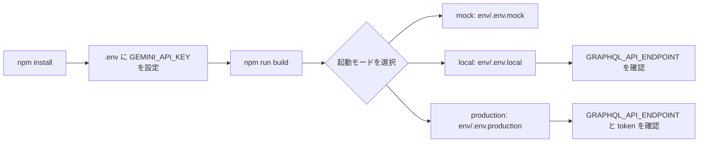

# 01 Getting Started

この章では、プロジェクトを手元で起動するための最初の手順をまとめます。

## Overview Diagram

## この章で扱う内容

- 依存インストール
- フロントビルド
- サーバー起動
- `.env` と `env/.env.<mode>` の運用方針
- 環境変数の設定とモード選択
- Windows (PowerShell) での実行時注意点
- mock / local / production の使い分けの入口

## 文書一覧

- [01_installation.md](01_installation.md): インストールと起動
- [02_configuration.md](02_configuration.md): 環境変数と設定値の説明

## 最短手順

### セットアップ

1. `npm install`
2. ルートの `.env` に `GEMINI_API_KEY` を設定
3. `npm run build`

Windows で PowerShell の実行ポリシーにより `npm.ps1` がブロックされる場合は、
`cmd /c npm run build` を使用してください。

### 起動

- `npm run start:mock`
- `npm run start:local`
- `npm run start:production`

最初は mock モードで起動し、その後に local モードで GraphQL 接続を確認する流れが安全です。

## 次の章へ進む前に

- 設定値の詳細: [02_configuration.md](02_configuration.md)
- システム全体像: [../02_architecture/README.md](../02_architecture/README.md)
- モードの詳細: [../04_runtime_modes/README.md](../04_runtime_modes/README.md)
- MCP 実装の詳細: [../03_mcp_implementation/README.md](../03_mcp_implementation/README.md)