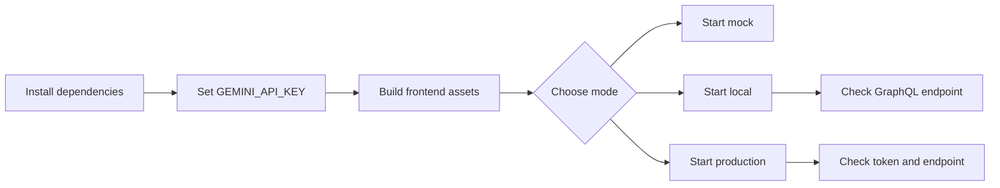

# 01 Getting Started

この章では、プロジェクトを手元で起動するための最初の手順をまとめます。

## Overview Diagram

## この章で扱う内容

- 依存インストール
- フロントビルド
- サーバー起動
- 環境変数の設定
- mock / local / production の使い分けの入口

## 文書一覧

- [01_installation.md](01_installation.md): インストールと起動
- [02_configuration.md](02_configuration.md): 環境変数と設定値の説明

## 最短手順

1. `npm install`
2. `.env` に `GEMINI_API_KEY` を設定
3. `npm run build`
4. `npm run start:mock` または `npm run start:local`

最初は mock モードで起動し、その後に local モードで GraphQL 接続を確認する流れが安全です。