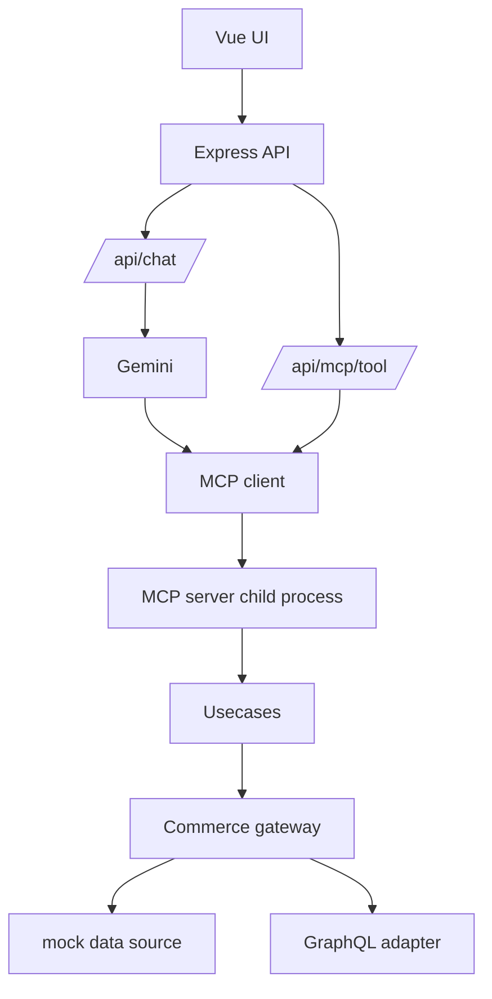

# 02 Architecture

この章では、プロジェクト全体の構成と責務分離を説明します。

## Overview Diagram

## 文書一覧

- [01_system_overview.md](01_system_overview.md): システム全体像と主要コンポーネント
- [02_request_flow.md](02_request_flow.md): チャット経路、直接ツール実行経路、補助 API

## この章の目的

- UI、Express、MCP、Usecase、Gateway の境界を把握する
- どこで mode 切り替えが行われるかを理解する
- GraphQL と mock の責務差し替え点を把握する