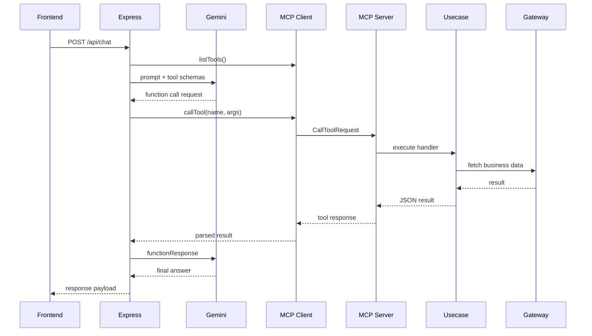

# 03 MCP Implementation

この章では、MCP クライアント / サーバー、tool registry、Gemini Function Calling 連携を整理します。

## Overview Diagram

## 文書一覧

- [01_server_and_client.md](01_server_and_client.md): 親子プロセスと MCP 接続
- [02_tool_registry.md](02_tool_registry.md): tool 定義、schema、handler 解決
- [03_function_calling.md](03_function_calling.md): Gemini 連携、リトライ、ループ防止、runtime diagnostics

## この章の目的

- Express 親プロセスと MCP 子プロセスの分離を理解する
- tool registry ベースの実装理由を把握する
- チャット時にツールがどう呼ばれるかを追えるようにする