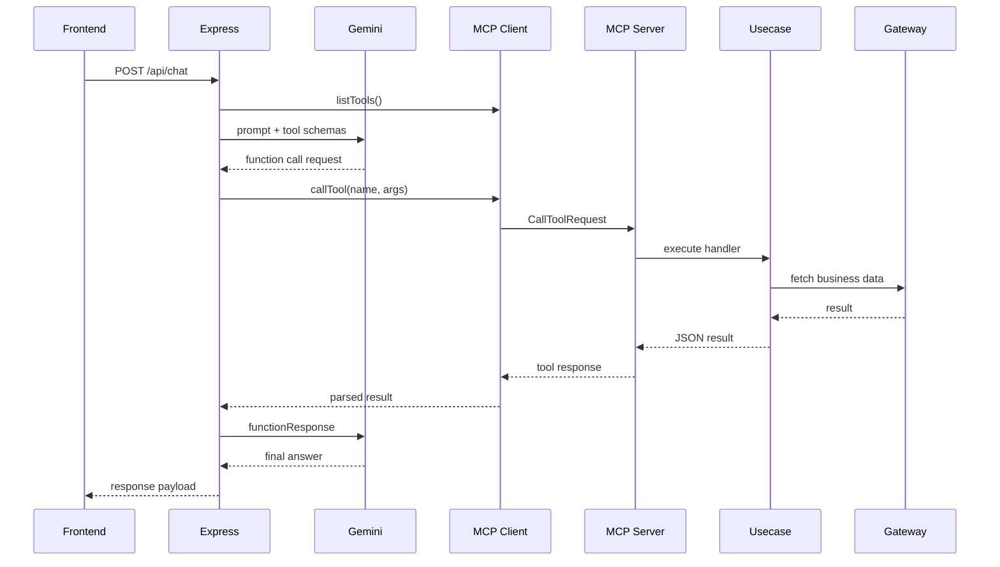

# 03 MCP Implementation

この章では、MCP クライアント / サーバー、tool registry、Gemini Function Calling 連携を整理します。

## Overview Diagram

この章では、MCP 仕様レベルの説明だけでなく、実装上の責務分離
(親プロセスのオーケストレーション / 子プロセスの tool 実行) を重視して整理します。

## 文書一覧

- [01_server_and_client.md](01_server_and_client.md): 親子プロセスと MCP 接続
- [02_tool_registry.md](02_tool_registry.md): tool 定義、schema、handler 解決
- [03_function_calling.md](03_function_calling.md): Gemini 連携、リトライ、ループ防止、runtime diagnostics
- [04_curry_ingredients_e2e_flow.md](04_curry_ingredients_e2e_flow.md): 「カレーの具材を教えて」のプログラムレベル E2E フロー

## この章の目的

- Express 親プロセスと MCP 子プロセスの分離を理解する
- tool registry ベースの実装理由を把握する
- チャット時にツールがどう呼ばれるかを追えるようにする

## 次の章

- mode ごとの動作差分: [../04_runtime_modes/README.md](../04_runtime_modes/README.md)
- GraphQL 契約の詳細: [../05_api_reference/README.md](../05_api_reference/README.md)