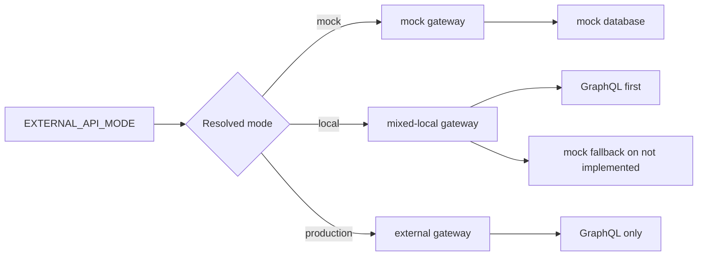

# 04 Runtime Modes

この章では `mock`、`local`、`production` の 3 モードを詳細に説明します。

## Overview Diagram

## 文書一覧

- [01_mode_resolution.md](01_mode_resolution.md): モード解決ルールと設定伝播
- [02_mock_mode.md](02_mock_mode.md): mock モードの用途と挙動
- [03_local_mode.md](03_local_mode.md): local モードの mixed 構成と確認手順
- [04_production_mode.md](04_production_mode.md): production モードの前提条件と運用観点

## この章の目的

- mode 解決ロジックを親子プロセスの両方で理解する
- local の mixed-local 構成を明示する
- production に mock フォールバックがないことを明確にする