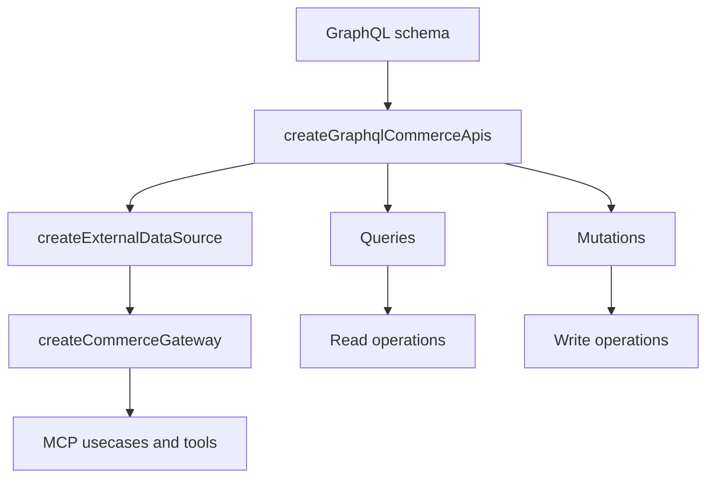

# 05 API Reference

この章では、GraphQL wrapper と API 仕様の対応関係を整理します。

## Overview Diagram

## 文書一覧

- [01_graphql_integration.md](01_graphql_integration.md): アプリ側の GraphQL 連携実装
- [02_graphql_api_spec.md](02_graphql_api_spec.md): GraphQL API の仕様整理

## この章の目的

- mock データソース相当の責務が、どの query / mutation に対応するか明らかにする
- adapter がどこで shape を変換しているかを示す
- production で必要な GraphQL 実装範囲を確認できるようにする